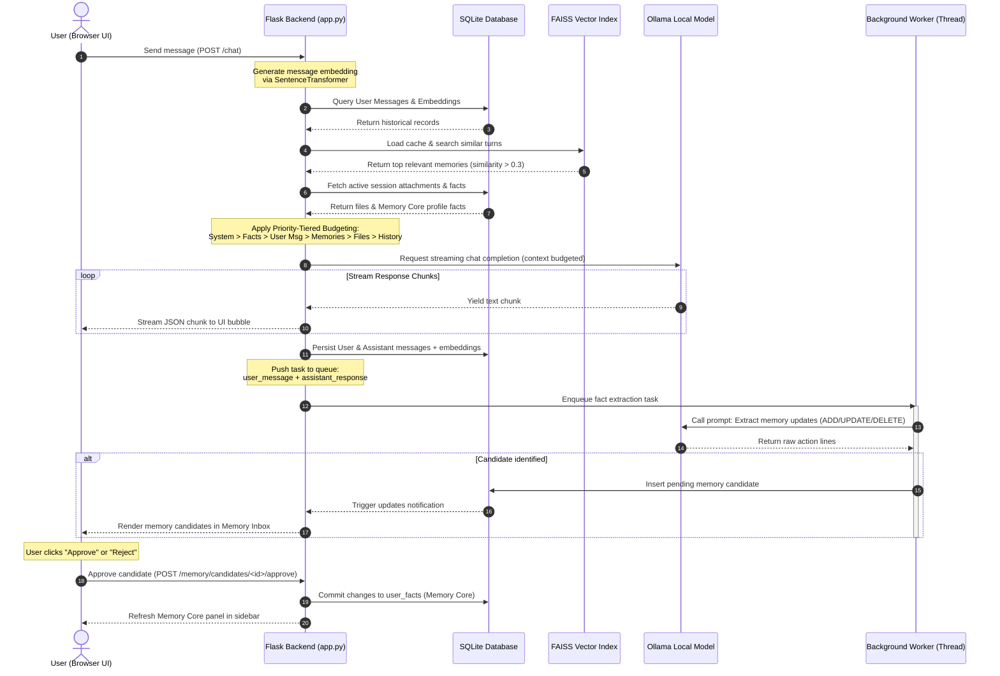

# Local AI Chat App with Human-like Memory

A sophisticated ChatGPT-like interface built with Flask that integrates LLMs (Ollama based) with human-like memory capabilities using semantic search and embeddings.


## Features

### Core Capabilities
- **Human-like Memory**: Semantic search through conversation history using sentence transformers.
- **Multiple Chat Sessions**: Support for multiple concurrent conversations with unique identifiers.
- **Real-time Web Interface**: Modern, responsive chat UI with real-time messaging.
- **Context-Aware Responses**: Intelligent context window management for optimal AI performance.
- **Priority-Tiered Context Budgeting**: Implements strict token/character allocation, ensuring file attachments or long histories never crowd out core user facts.
- **Transparent Memory**: Shows which past conversations influenced current responses.
- **Chat Management**: Search, rename, delete, and export conversations from the sidebar.
- **Markdown Responses**: Assistant replies render basic markdown and code blocks in the browser.
- **Copy Actions**: Copy assistant responses directly from each message.
- **Streaming Replies**: Assistant output streams into the chat bubble as it is generated.
- **File Attachments**: Upload text-based files and use them as direct chat context.
- **Persistent Memory Core**: Automatically extracts and logs permanent facts/preferences about the user in a persistent profile to guide persona alignment.
- **Memory Inbox**: A human-in-the-loop interface that lets you approve, update, or reject memory candidate facts proposed by the background pipeline.
- **Dynamic Model Switcher**: Change your active Ollama model instantly from a dropdown list in the interface header.

### Technical and Security Features
- **Semantic Memory System**: Uses FAISS for efficient similarity search across embeddings.
- **User Authentication**: Secure register, login, and logout endpoints with password hashing.
- **Data Isolation**: Multi-user tenancy: database queries strictly isolate sessions, facts, and attachments by owner ID.
- **CSRF Protection**: Native Flask-WTF CSRFProtect guarding all mutating API paths.
- **Content Security Policy**: Custom headers enforcing secure script and resource limits.
- **Persistent Storage**: SQLite database for chat history and session management.
- **Ollama Integration**: Seamless integration with locally running AI models.
- **Thread-Safe Operations**: Concurrent user support with proper locking mechanisms.
- **Health Monitoring**: Built-in health checks for all system components.

## Architecture

```
┌─────────────────┐    ┌──────────────────┐    ┌─────────────────┐
│   Web Frontend  │    │  Flask Backend   │    │   LLMs/ APIs     │
│   (HTML/JS)     │◄──►│                  │◄──►│   (via Ollama)  │
└─────────────────┘    │  - Chat API      │    └─────────────────┘
                       │  - Session Mgmt   │
                       │  - Memory System  │    ┌─────────────────┐
                       └──────────┬───────┘    │   SQLite DB     │
                                  │            │  - Messages     │
                                  └───────────►│  - Sessions     │
                                               │  - Embeddings   │
                                               └─────────────────┘
```

### Visualized System Architecture Sequence



## Quick Start

### Prerequisites

1. **Python 3.10+** installed on your system
2. **Ollama** running locally with downloaded model
3. **Git** for cloning (optional)

### Installation

1. **Clone or download the project**:
   ```bash
   git clone <repository-url>
   cd local-ai-chat-memory
   ```

2. **Create and activate virtual environment**:
   ```bash
   python -m venv venv
   
   # On Windows
   venv\Scripts\activate
   
   # On macOS/Linux
   source venv/bin/activate
   ```

3. **Install dependencies**:
   ```bash
   pip install -r requirements.txt
   ```

4. **Set up Ollama with local model** (if not already done):
   ```bash
   # Install Ollama first (visit https://ollama.ai)
   
   # Pull a local model (e.g., llama3 or qwen2.5)
   ollama pull <model-name>
   
   # Verify model is running
   ollama list
   ```

5. **Configure environment variables** (optional):
   Create a `.env` file in the project root:
   ```env
   SECRET_KEY=your-secret-key-here
   OLLAMA_BASE_URL=http://localhost:11434
   LOCAL_MODEL_NAME=your-model-name
   MAX_CONTEXT_LENGTH=4096
   TOP_K_MEMORIES=5
   DATABASE_PATH=chat_history.db
   ```

6. **Run the application**:
   ```bash
   python app.py
   ```

7. **Open your browser** and navigate to `http://localhost:5000`

## Usage

### Basic Chat
1. Open the web interface.
2. Type your message in the input field.
3. Press Enter or click Send.
4. The AI will respond using context from your conversation history.

### Memory Features
- **Automatic Memory**: The system automatically remembers all conversations.
- **Semantic Retrieval**: Relevant past conversations are retrieved based on context.
- **Memory Transparency**: See which memories influenced each response.
- **Memory Inbox**: Review memory actions before they are added to the Memory Core.
- **Session Management**: Switch between different chat sessions.

## API Endpoints

### Authentication Endpoints

#### User Registration
```http
POST /register
Content-Type: application/json

{
  "username": "yourusername",
  "password": "yourpassword"
}
```

#### User Login
```http
POST /login
Content-Type: application/json

{
  "username": "yourusername",
  "password": "yourpassword"
}
```

#### User Logout
```http
GET /logout
```

### Chat and Session Endpoints

#### Chat Endpoint
```http
POST /chat
Content-Type: application/json

{
  "message": "Your message here",
  "stream": true,
  "model": "your-model-name"
}
```

#### Get Chat History
```http
GET /history/<session_id>
```

#### Get All Sessions
```http
GET /sessions
```

#### Start New Session
```http
POST /new_session
```

#### Delete Session
```http
DELETE /sessions/<session_id>
```

#### Rename Session
```http
POST /sessions/<session_id>/rename
Content-Type: application/json

{
  "title": "New Session Title"
}
```

### Memory and Fact Governance Endpoints

#### Get User Profile Facts
```http
GET /facts
```

#### Delete User Fact
```http
DELETE /facts/<fact_id>
```

#### Get Memory Inbox Candidates
```http
GET /memory/candidates
```

#### Approve Memory Candidate
```http
POST /memory/candidates/<candidate_id>/approve
```

#### Reject Memory Candidate
```http
POST /memory/candidates/<candidate_id>/reject
```

#### Get Available Ollama Models
```http
GET /models
```

#### Health Check
```http
GET /health
```

## Configuration

### Model Settings
- **Context Length**: Adjust `MAX_CONTEXT_LENGTH` for longer conversations.
- **Memory Retrieval**: Modify `TOP_K_MEMORIES` to change how many past conversations to consider.
- **Model Selection**: Change `LOCAL_MODEL_NAME` to use different model variants.

### Database Configuration
- **SQLite Path**: Modify `DATABASE_PATH` to change database location.
- **Custom Database**: Replace SQLite with PostgreSQL or MySQL for production.

### Memory System Tuning
- **Embedding Model**: Change sentence transformer model in `utils.py`.
- **Similarity Threshold**: Adjust relevance threshold in `MemorySystem.search_relevant_memories()`.
- **FAISS Index**: Modify index type for different performance characteristics.

## Testing

### Automated Tests
Run unit and integration tests locally:
```bash
python test_app.py
python test_security.py
```

### Manual Testing
1. Start the application.
2. Open multiple browser tabs to test concurrent sessions.
3. Test memory retrieval by referencing past conversations.
4. Verify session switching works correctly.

## Troubleshooting

### Common Issues

#### Ollama Connection Failed
- Ensure Ollama is running: `ollama list`
- Check the correct port (default: 11434)
- Verify local model is downloaded: `ollama pull model_name`

#### Memory Not Working
- Check if sentence-transformers is properly installed.
- Verify FAISS installation: `pip install faiss-cpu`
- Look for embedding generation errors in logs.

#### Database Issues
- Ensure write permissions in the application directory.
- Check SQLite installation.
- Verify database file is not corrupted.

#### Performance Issues
- Reduce `MAX_CONTEXT_LENGTH` for faster responses.
- Lower `TOP_K_MEMORIES` to reduce memory search time.
- Consider upgrading to GPU-accelerated FAISS.

### Debug Mode
Enable debug logging by setting the environment variable:
```bash
export FLASK_DEBUG=1
python app.py
```

## Development

### Project Structure
```
local-ai-chat-memory/
├── app.py              # Main Flask application
├── utils.py            # Core utility classes
├── requirements.txt    # Python dependencies
├── README.md          # This file
├── .env.example       # Environment variables template
├── templates/
│   └── index.html     # Web interface template
├── static/            # CSS/JS assets
└── tests/            # Unit tests
```

### Key Components

#### ChatHistoryManager
- Manages SQLite database operations.
- Handles message storage and retrieval.
- Manages session metadata.

#### MemorySystem
- Handles sentence embedding generation.
- Implements semantic search using FAISS.
- Manages similarity scoring and relevance filtering.

#### LocalModelInterface
- Manages communication with Ollama API.
- Handles request/response formatting.
- Implements error handling and retries.

## Security Considerations

### Production Deployment
- Change default secret key.
- Use environment variables for sensitive configuration.
- Implement rate limiting.
- Add authentication and authorization.
- Use HTTPS in production.

### Data Privacy
- Encrypt sensitive data in database.
- Implement data retention policies.
- Add user consent mechanisms.
- Regular security audits.

## Monitoring and Logging

### Application Monitoring
- Monitor response times and error rates.
- Track memory usage and database performance.
- Set up alerts for system failures.

### Logging Configuration
Customize logging in `app.py`:
```python
import logging

logging.basicConfig(
    level=logging.INFO,
    format='%(asctime)s - %(name)s - %(levelname)s - %(message)s',
    handlers=[
        logging.FileHandler('app.log'),
        logging.StreamHandler()
    ]
)
```

## Contributing
1. Fork the repository.
2. Create a feature branch.
3. Make your changes.
4. Add tests for new functionality.
5. Submit a pull request.

## License
This project is licensed under the MIT License - see the LICENSE file for details.

## Acknowledgments
- Ollama and LLM Creators for the excellent language models.
- Ollama for the easy-to-use model serving platform.
- Sentence Transformers for semantic similarity capabilities.
- FAISS for efficient similarity search.
- Flask for the web framework.

## Additional Resources
- [Ollama Models Library](https://ollama.com/library) for finding local models to run.
- [Ollama Documentation](https://ollama.ai/docs)
- [Sentence Transformers Documentation](https://sbert.net/)
- [FAISS Documentation](https://faiss.ai/)
- [Flask Documentation](https://flask.palletsprojects.com/)

---

**Built with support for the AI community**
